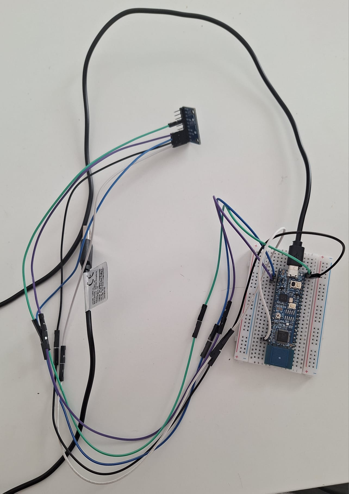

Hardware requirements
=====================
- Micro USB cable
- LPC845 Breakout board
- MPU 6500 / an accelerometer
- Personal Computer

Air Mouse (more like air cursor) was built using NXP's LCP845 Breakout Board and a random MPU 6500. To try this project yourself, build and flash the C code to your board and then build & run the C++ code.

Helped me expand my Serial Communcation knowledge (I2C protocol), learned some sensor physics and become more confident in wiring together different components by myself.

Will not receive any future updates untill I change my laptop, since 90% of the time my laptop would refuse to read the data from the LCP (faulty ports). While plugged in to my partner's macbook, the stream of data sent by the LPC would be flawleslly read by the laptop. "Debugging" by gambling on whether the port will work this time or not is unfun!

