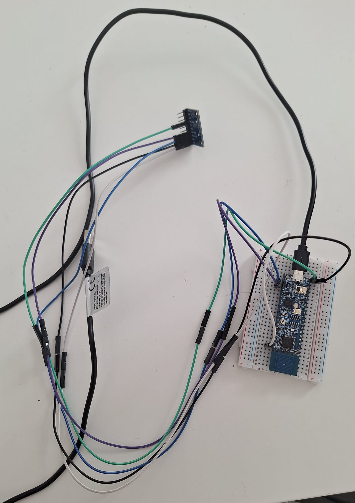

# Air Mouse
This project was built using NXP's LPC845 Breakout Board and an MPU 6500, with the 2 pieces of hardware communicating to each other through I2C.

## Hardware requirements
- Micro USB cable
- LPC845 Breakout board
- MPU 6500 / an accelerometer
- Personal Computer

## Wiring
- VCC -> VCC
- GND -> GND
- SDO -> GND
- SDI -> PIO0_11
- SCL -> PIO0_10
- (Excuse the potato quality picture)



## Running
First, flash the board with the code. Afterwards, run the following commands:
```bash
g++ -o mouse mouse.cpp
sudo ./mouse [optional: add the port the microcontroller is connected to]
```

## Challenges I encountered
This project proved to me quite challenging to me. First, I had to learn how to weld and wire different component together. Then I had to learn serial protocols for transferring data (I2C) and sensor physics for the MPU. Finally, I had to scour the internet for articles about injecting mouse events and virtual mice.

I plan on revisiting this project in the near future, with my goal being to refactor the code and add buttons.
